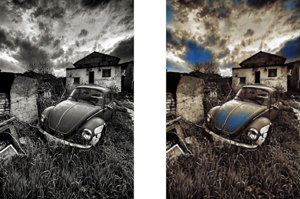

# Colorisation

Ce projet présente un système de colorisation d'images utilisant une architecture vanilla (auto-encodeur) avec le framework Keras. Entrainé sur un sous-ensemble d'ImageNet (images de dimension 64x64 pour un total de 13Go), le modèle vise à revitaliser des images en noir et blanc en générant des couleurs naturelles.

Des techniques de post-traitement ont été intégrées pour affiner la colorimétrie, offrant ainsi des résultats visuellement plus intéressant.

## Entraîner le modèle

Construction de l'image Docker, notamment des dépendances Python:

> docker build . -t colorisation

Exécution de l'entraînement. Lors de la première exécution, le téléchargement du dataset ImageNet prend plusieurs minutes:

> docker run